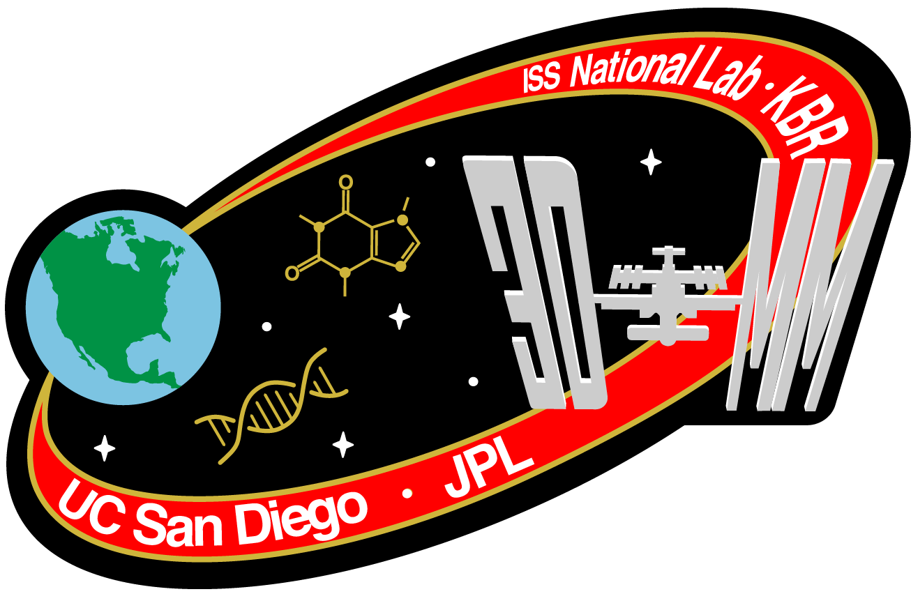

# Three-Dimensional Microbial Mapping (3DMM)


This repository contains scripted workflows for microbiome data analysis to reproduce the key findings of the paper **_The International Space Station Has a Unique and Extreme Microbial and Chemical Environment Driven by Use Patterns_** and generate most of the published figures. 

## Summary of findings. 
>Space habitation provides unique challenges in built environments isolated from Earth. We produced a 3D map of the microbes and metabolites throughout the United States Orbital Segment (USOS) of the International Space Station (ISS), with 803 samples collected during space flight, including controls. We find that the use of each of the nine sampled modules within the ISS strongly drives the microbiology and chemistry of the habitat. Relating the microbiology to other Earth habitats, we find that, as with human microbiota, built environment microbiota also align naturally along an axis of industrialization, with the ISS providing an extreme example of an industrialized environment. We demonstrate the utility of culture-independent sequencing for microbial risk monitoring, especially as the location of sequencing moves to space. The resulting resource of chemistry and microbiology in the space-built environment will guide long-term efforts to maintain human health in space for longer durations.

## Installation
The repository relies on the [QIIME 2](https://docs.qiime2.org/2024.10/install/) bioinformatics platform, installed in a conda virtual environment. Due to dependencies on certain analysis packages and the timeline of the project, multiple QIIME 2 releases were used. Conda environment files for these releases are included for convenient installation.

To install the required QIIME 2 environments, use the provided `.yml` files. 
## Install QIIME 2 Environments:
For QIIME 2 release 2021.8:
```
conda env create -f qiime2-2021.8_3DMM.yml
```
For QIIME 2 release 2023.5:
```
conda env create -f qiime2-2023.5_3DMM.yml
```
## Running Jupyter Notebooks
Most analyses in this study were conducted using Jupyter Notebooks (Electronic Lab Notebooks, ELNs). Some components were performed externally in Qiita or on a high-performance cloud computing cluster. Output files from analyses performed outside of Jupyter are included in this repository to enable reproduction of the published figures.
### Steps to Run Jupyter Notebooks
After installing the required QIIME 2 environments, activate the environment and launch a Jupyter Notebook instance.
#### QIIME 2 (2021.8): KatharoSeq, Microbial Composition, Source Tracking, and Metagenomics. 
The QIIME 2 2021.8 release was used for data preprocessing (KatharoSeq), microbiome composition analysis, source tracking, metagenomic species identification, and antimicrobial resistance (AMR) analyses.

To activate the environment and start Jupyter Notebook, run:
```
conda activate qiime2-2021.8
jupyter notebook
```
Then, navigate to the following notebooks and execute the modules sequentially:
- 1_3DMM_pre-processing_KatharoSeq.ipynb
- 2_3DMM_alpha_beta_diversity.ipynb
- 3_3DMM_source_tracker.ipynb
- 5_3DMM_metagenomics.ipynb
- 6_3DMM_AMR.ipynb

#### QIIME 2 (2023.5): Multi-Study Analysis
The QIIME 2 2023.5 release was used for the multi-study analysis.
To activate the environment and start Jupyter Notebook, run:
```
conda activate qiime2-2023.5
jupyter notebook
```
Then, navigate to the following notebook and execute the modules sequentially:
- 4_3DMM_multi-study_analysis.ipynb

## Citation
The citation for the manuscript will be updated once the paper is published...
```
Pending Cell pubication. 
```
